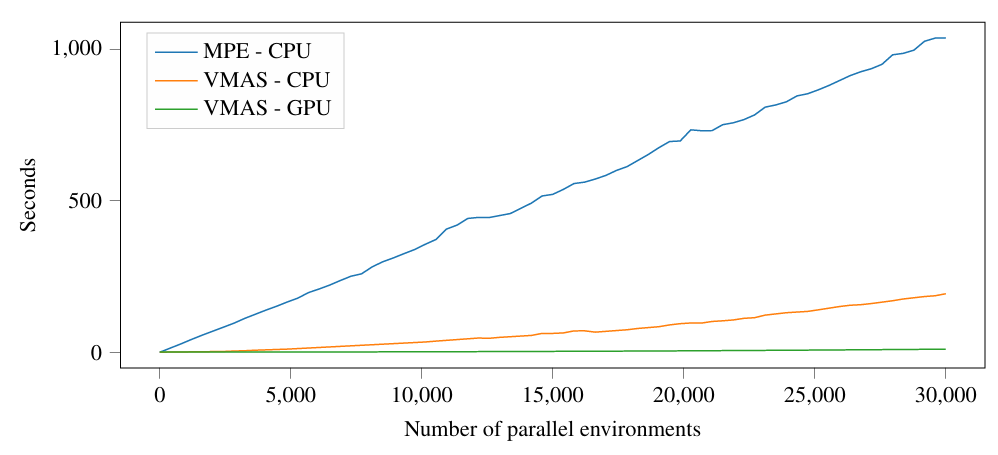
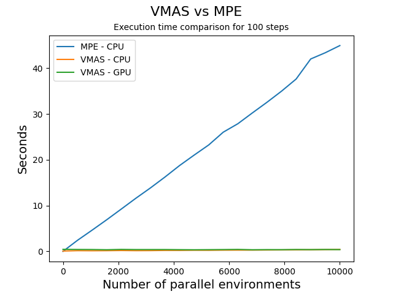
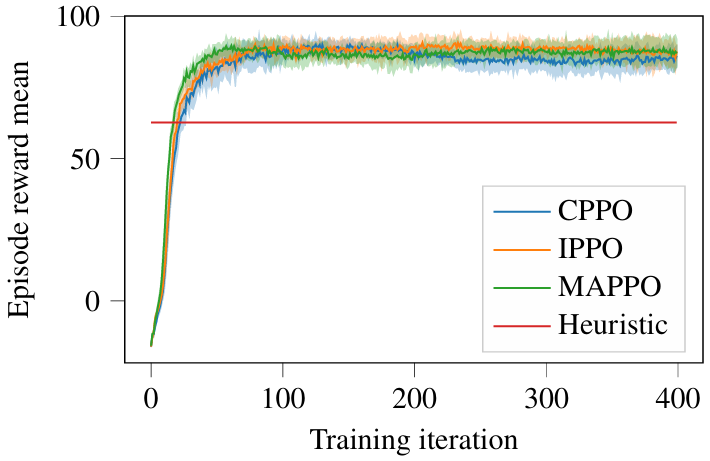
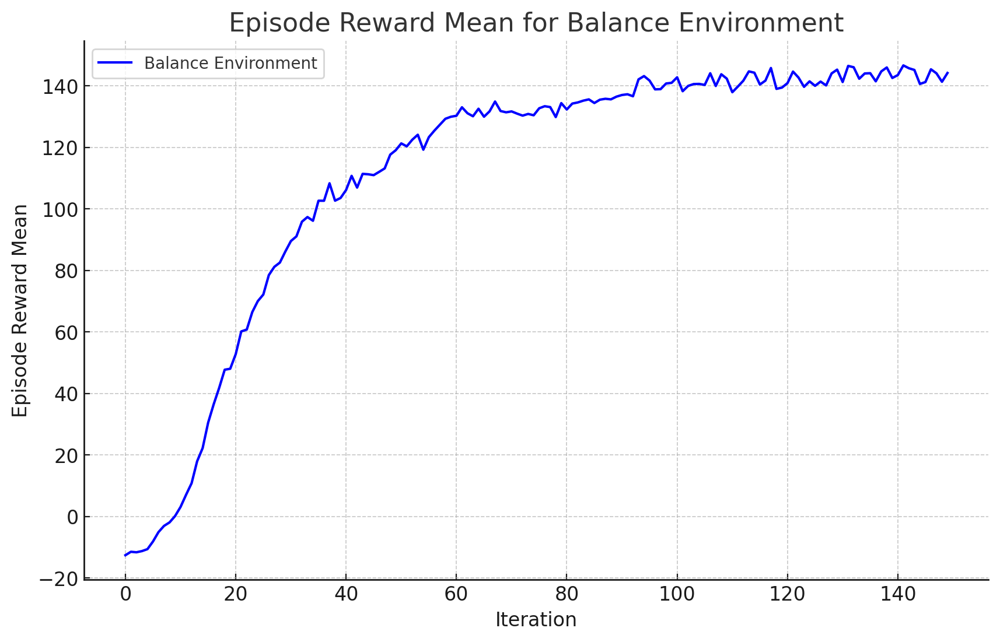
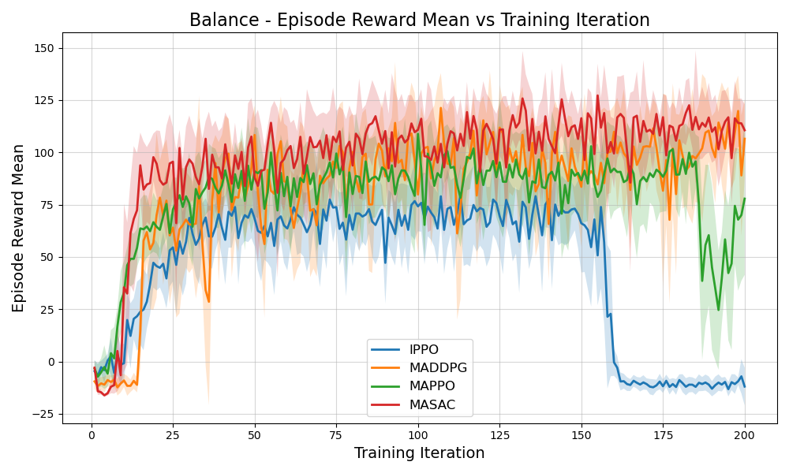
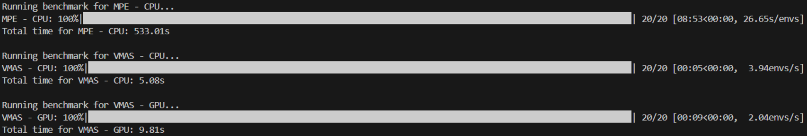
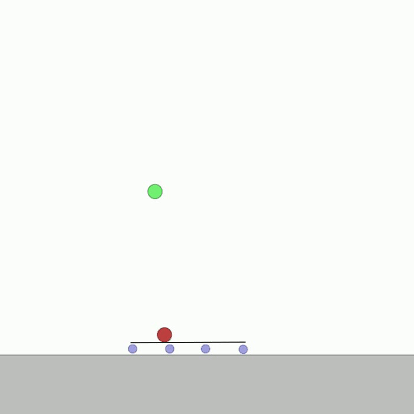
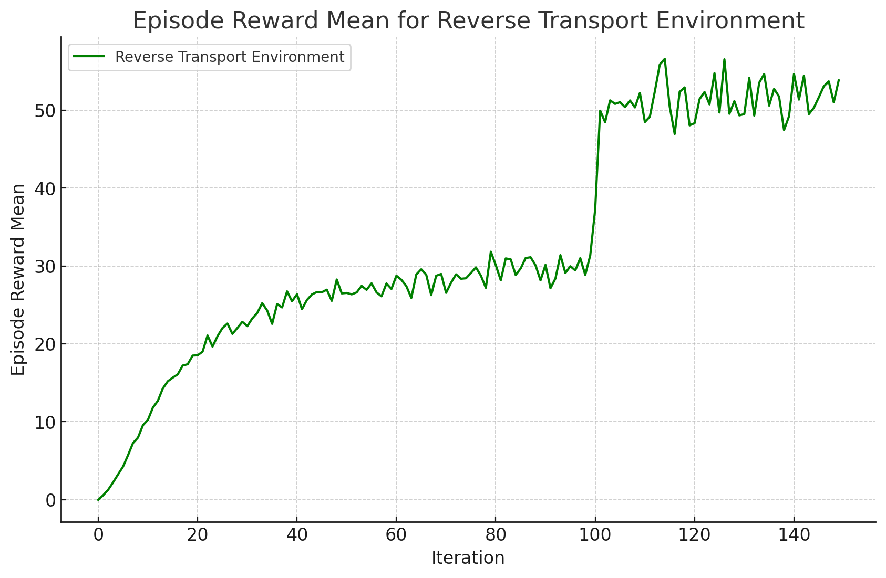
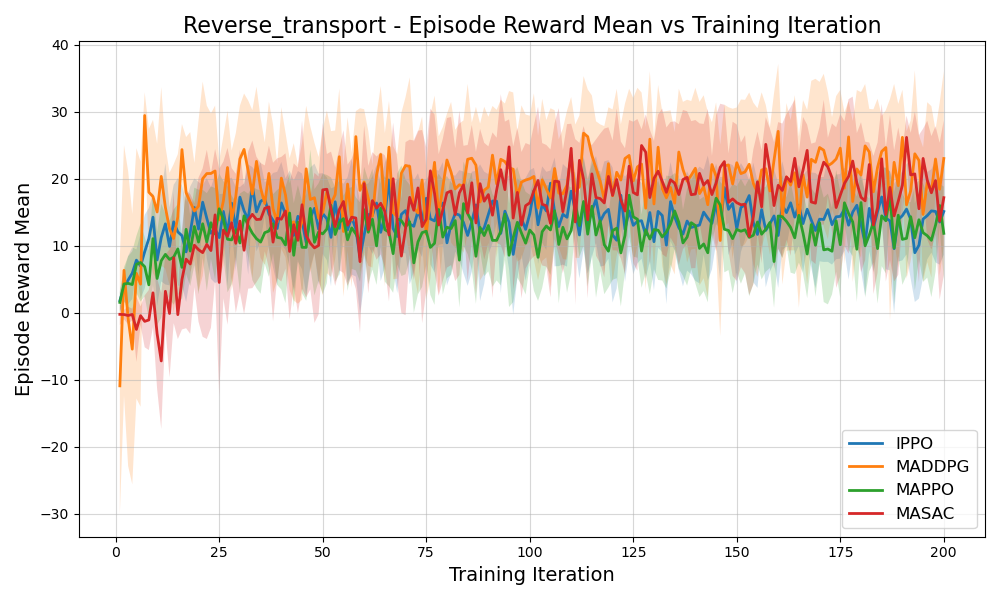
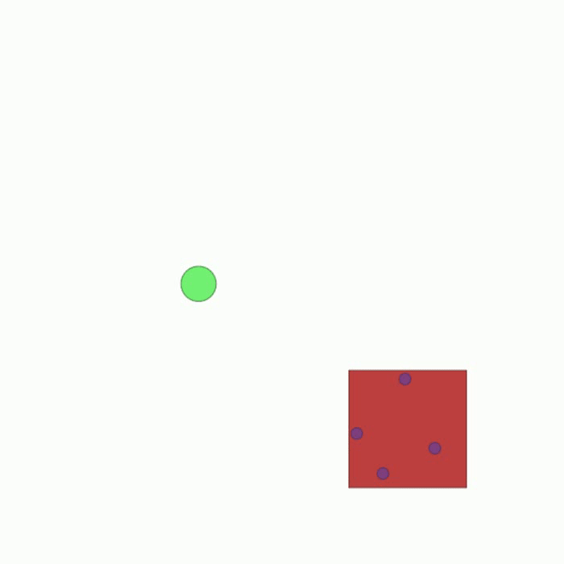

# VectorizedMultiAgentSimulator (VMAS): Replication and Enhancements

This repository focuses on replicating and enhancing the experiments from [VMAS](https://github.com/proroklab/VectorizedMultiAgentSimulator) as detailed in the paper:

Bettini, M., Kortvelesy, R., Blumenkamp, J., & Prorok, A. (2023). VMAS: A Vectorized Multi-Agent Simulator for Collective Robot Learning [Conference paper](https://arxiv.org/pdf/2207.03530v2). Proceedings of the 16th International Symposium on Distributed Autonomous Robotic Systems.
 
 

## Structure
The repository is divided into three main folders:

1. **`vmasmpe`**:
   - Contains scripts to compare MPE and VMAS performance.
   - Includes GPU-compatible code and results visualization.

2. **`rllib`**:
   - Includes RLlib-based training scripts with video rendering.
   - Contains a performance-focused script and graphing tools.

3. **`bmarl`**:
   - Features BenchMarl training scripts for various MARL algorithms.
   - Includes plotting tools to visualize algorithm performance.

**!! Each one of the folders contain a `readme.md` file explaining the code.**
 
 

## Work Process
1. [Task Identification](#task-identification) Carefully studied the original paper.
   Defined tasks to replicate and enhance key experiments.
3. [Replication, Modification and Comparison](#replication-modification-and-comparison)
   Recreated the experiments, updated outdated code, and enhanced functionalities. Side by side comparison with original results.
5. [Results and Analysis](#results-and-analysis)
   Visualization of the modified implementation results.
6. [Outcome](#outcome)
   Achieved the same main conclusions as the original paper with improved performance in some cases.
 
 

## Task Identification
The key tasks identified for replication and enhancement were:

1. **Comparison of VMAS and OpenAI MPE**:
   - Demonstrate the scalability benefits of VMAS compared to MPE, running up to 30,000 parallel simulations in under 10 seconds.
   - Verify that VMAS is up to 100x faster than MPE.
   - Verify the computational efficiency of VMAS for multi-agent learning tasks on GPU versus CPU.

2. **Balance and Reverse Transport Tasks**:
   - Implement scenarios for Balance and Reverse Transport using VMAS's [RLlib](https://docs.ray.io/en/latest/rllib/index.html) interface.
   - Use various Proximal Policy Optimization (PPO)-based MARL algorithms.

3. **Algorithm Benchmarks**:
   - Benchmark PPO-based algorithms like MAPPO and IPPO.
   - Run experiments for 400 training iterations. Each training iteration performs around 60,000 time steps.
 
 

## Replication, Modification and Comparison

### A. MPE vs VMAS
- **Replication**: The replication of this task turned out to be very time consuming.
VMAS's source code was completely outdated, the visualization that was displayed in the paper could't even be obtained with the given code. Fully rewrote outdated code to compare MPE and VMAS performance.

- **Enhancements**:
  - New, faster and up to date code.
  - Added GPU support via PyTorch.
  - Modified plotting to replicate the paper's graph.
  - Limited tests to 10,000 parallel environments to conserve resources.
- **Comparison**:
  - VMAS on GPU demonstrated over 100x faster simulation speeds compared to MPE on CPU.
  - Results validated scalability benefits of vectorization.
  - Newer PyTorch's implementation had faster results.
  - The new software and hardware showed improved results but overall the same conclusions can be taken.
 
 

  | Paper's Graph | Replication |
  |:-------------:|:-----------:|
  |  |  |

  

### B. RLlib Experiments
- **Replication**: VMAS's provided code was robust but some components did not work. `pyvirtualdisplay` library did not display the environments correctly and [WanDB](https://wandb.ai/home) wasn't properly saving training episodes videos.

  VMAS's repository did not contain code for any of the algorithms mentioned in the paper. Their RLlib implementation only used basic PPO training and could not be adapted due to RLlib's limitations.

- **Enhancements**:
  - Removed `pyvirtualdisplay`.
  - Introduced video rendering for visualizing training progress.
  - Now saves videos locally instead of using WanDB.
  - Developed a lightweight performance-focused script for benchmarking.
  - Early stopping that reduced training iterations from 400 to 150.
- **Comparison**:
  - Even though it was not possible to replicate all the algorithms mentioned in the paper, the implemented PPO outperformed all the paper's algorithms.
  - Newer hardware made a 55% increase in the code performance.
 
 

  | Paper's Graph | Replication |
  |:-------------:|:-----------:|
  |  |  |

### C. BenchMarl Experiments
- **Implementation**: Made new code that uses [BenchMarl](https://github.com/facebookresearch/BenchMARL) for faster, more reliable MARL experiments. BenchMARL is a training library created to enable reproducibility and benchmarking across different MARL algorithms and environments.

  Since neither RLlib nor VMAS had MAPPO, IPPO or CPPO algorithm implementations, BenchMarl was used to test those algorithms.

- **Enhancements**:
  - Made a python script instead of using terminal commands.
  - Implemented MAPPO, IPPO, MASAC, and MADDPG algorithms.
  - Supported Balance and Reverse Transport scenarios.
  - Plotted interesting visualizations of the results.
- **Comparison**:
  - BenchMarl outperformed RLlib in training speed and stability.
  - Allowed evaluation of a broader set of algorithms.
  - Both MADDPG and MASAC performed better that the algorithms cited in the paper.
 
 

  | Paper's Graph | Implementation |
  |:-------------:|:--------------:|
  |  |  |

 
 

## Results and Analysis
- **VMAS vs MPE**:
  - VMAS on CPU achieved up to 100x faster parallelization compared to MPE on CPU.
  - VMAS on GPU took longer than on CPU due to PyTorch's initialization and memory allocation.
  - Scalability benefits were consistent with the original findings.
  - The image below shows the total time to set up parallel environments (500, 1000, ..., 10000) on MPE and VMAS.
 
 

  
 
 

- **Balance Scenario**:
  - BenchMarl offered faster execution and supported additional algorithms like MAPPO and IPPO.
  - RLlib's outdated implementation posed challenges in replicating results.
  - RLlib's PPO reached a stable reward by 80 training iterations while BenchMarl Algorithms only took around 25 iterations.
  - Overall the agents performed good, completed the task successfully and reached a stable reward.
 
 

  | RLlib's PPO | BenchMarl |
  |:-----------:|:---------:|
  |  |  |

  

    
      Learned Policy
  

 
 

- **Reverse Transport Scenario**:
  - BenchMarl displays stable results across all algorithms. The episode length was capped at 150ts in contrary to RLlib's 300ts. This was done because BenchMarl was solely used for benchmarking purposes and to save computational resources.
  - RLlib's graph shows a big increase in reward around training iteration 100. This is due to the fact that by training iteration 100 the episode length was changed from 300ts to 600ts to give the agents more time to reach the goal.
  - In this environment the episode length is what influences the results the most. All algorithms performed equally good.
 
 

  | RLlib's PPO | BenchMarl |
  |:-----------:|:---------:|
  |  |  |

  

    
      Learned Policy
  

 
 

## Outcome
After significant modifications and enhancements, our implementation:
- Improved simulation speeds and algorithm performance.
- Validated the original paper’s findings on scalability and efficiency.
- Enhanced outdated code to support modern algorithms and GPU-based parallelization.
 
 

## References
1. VMAS Paper: [VMAS: A Vectorized Multi-Agent Simulator for Collective Robot Learning](https://arxiv.org/pdf/2207.03530v2)
2. VMAS GitHub: [proroklab/VectorizedMultiAgentSimulator](https://github.com/proroklab/VectorizedMultiAgentSimulator)
3. BenchMarl Github: [facebookresearch/BenchMARL](https://github.com/facebookresearch/BenchMARL)
